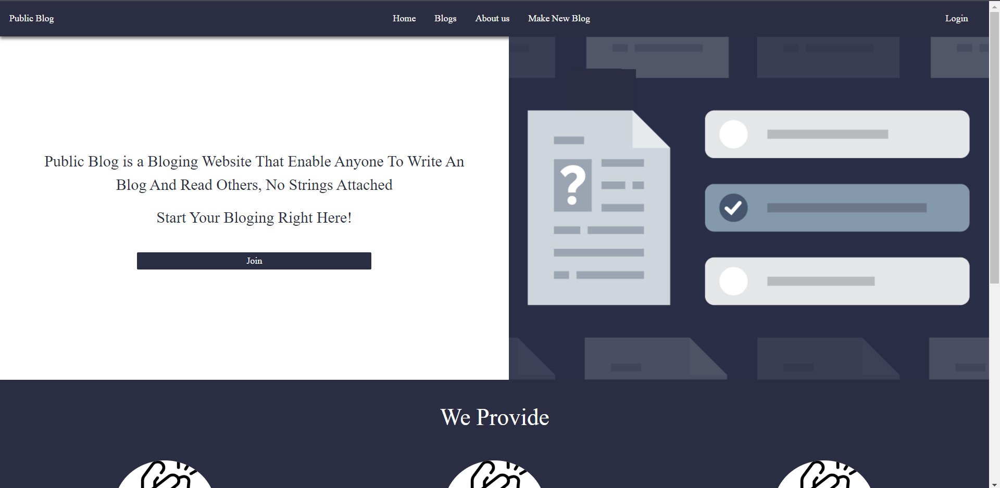

# Blog Maker and Hosting Website
in this Project, we built our first complete website for the course CS346
which covers the front-end and the back-end

the website is a place where users can signup and start making their own blogs using 
Markdown markup language (just like what GitHub uses for the README.md file)

users can view other blogs and theirs and also edit them or delete them if they want

# Technologies 🧠
  we used the following for this project:
  - HTML and CSS 
  - JavaScript
  - BootStrap
  - NodeJs With Express
  - MongoDB
  
  # installations 🚀
  - install NodeJs From [Here](https://nodejs.org/en/download/)
  - install MongoDB from [Here](https://www.mongodb.com/try/download/community)
  - Make sure to run `npm install` for the first time to install all the dependencies
  - take out the `data` folder and place it in the MongoDB local data path "should be in C:\\data"
  
  # SetUp⚙️
  - the chosen IP for the website is 127.0.0.1 and the PORT is 3000
  - the database is in the 27017 PORT
  - Run `npm start`
  - go to 127.0.0.1 in your browser

# Screen Shots

